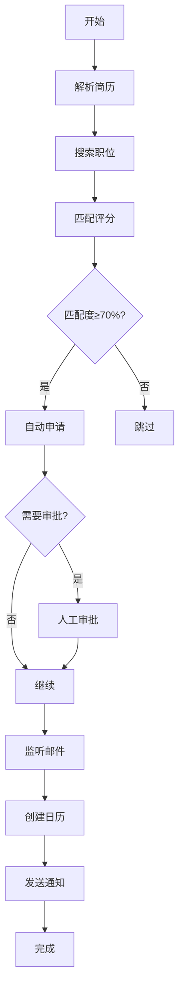

<div align="center">

# 🤖 AI Job Application Assistant

[](https://www.python.org/downloads/)
[](https://python.langchain.com/)
[](https://opensource.org/licenses/MIT)
[](https://github.com/xing345/ai-job-application-agent)

[📖 中文文档](README.md) | [🇺🇸 English](README.en.md)

**AI-Powered Job Application Assistant - 自动化求职助手**

> 使用 AI 技术实现从简历解析到职位申请的全流程自动化，大幅提升求职效率。

</div>

---

## 🎯 功能特性

### ✨ 核心功能
- **📝 简历解析** - 自动解析 PDF 简历，提取个人信息和工作经历
- **🔍 智能搜索** - 基于 Tavily API 搜索匹配的职位
- **🎯 精准匹配** - 使用 LLM 分析职位描述，计算匹配度
- **🤖 自动申请** - 使用 Playwright 自动填写申请表单
- **📧 邮件监听** - 自动监听面试邮件，智能分类处理
- **📅 日历同步** - 自动创建面试日历事件，发送提醒
- **🔄 状态管理** - 基于 LangGraph 的完整状态机管理

### 🚀 技术亮点
- **端到端自动化** - 一键完成整个求职流程
- **AI 驱动决策** - 大语言模型赋能的智能匹配
- **Human-in-the-Loop** - 关键节点人工干预，确保安全
- **模块化设计** - 高度解耦，易于扩展和维护
- **异步处理** - 高效的并发操作处理

---

## 🏗️ 架构设计

```
┌─────────────────────────────────────────────────────────────┐
│                     AI Job Application Agent                │
├─────────────────────────────────────────────────────────────┤
│  📱 CLI Interface                                           │
├─────────────────────────────────────────────────────────────┤
│  🔄 LangGraph State Machine                                │
├─────────────────────────────────────────────────────────────┤
│  🔍 Job Search  📝 Form Fill  📧 Email Monitor  📅 Calendar │
├─────────────────────────────────────────────────────────────┤
│  🤖 LLM Engine  🔗 Web APIs  📊 Data Models              │
└─────────────────────────────────────────────────────────────┘
```

---

## 📦 安装指南

### 环境要求
- Python 3.11+
- 有效的 API 密钥（OpenAI、Tavily、Google）

### 1. 克隆仓库
```bash
git clone https://github.com/xing345/ai-job-application-agent.git
cd ai-job-application-agent
```

### 2. 安装依赖
```bash
pip install -r requirements.txt
```

### 3. 配置 API 密钥
创建 `.env` 文件：
```bash
cp .env.example .env
```

编辑 `.env` 文件：
```env
# OpenAI API Key (用于 LLM 分析)
OPENAI_API_KEY=your_openai_api_key

# Tavily API Key (用于职位搜索)
TAVILY_API_KEY=your_tavily_api_key

# Gmail API (用于邮件监听 - 可选)
GMAIL_API_KEY=your_gmail_api_key
GMAIL_CLIENT_ID=your_gmail_client_id
GMAIL_CLIENT_SECRET=your_gmail_client_secret
GMAIL_REFRESH_TOKEN=your_gmail_refresh_token

# Google Calendar API (可选)
GOOGLE_CALENDAR_API_KEY=your_calendar_api_key
```

---

## 🚀 快速开始

### 基本使用
```bash
# 运行自动申请
python src/main.py -r resume.pdf -j "前端开发工程师"

# 交互式模式
python src/main.py --interactive

# 预览模式（不实际执行）
python src/main.py --dry-run -r resume.pdf -j "前端开发工程师"

# 查看简历信息
python src/main.py --info resume.pdf
```

### 完整参数
```bash
python src/main.py \
    --resume resume.pdf \
    --job "前端开发工程师" \
    --companies "字节跳动,腾讯,阿里巴巴" \
    --location "北京" \
    --salary "15-25K" \
    --experience "3-5年" \
    --keywords "React,Vue,TypeScript" \
    --exclude "管理,销售" \
    --max-applications 10 \
    --sites "boss,zhipin" \
    --verbose
```

---

## 📁 项目结构

```
ai-job-application-agent/
├── src/                          # 源代码
│   ├── models/                  # 数据模型
│   │   ├── schemas.py           # 简历、职位模型
│   │   ├── instruction_schemas.py  # 指令模型
│   │   └── interview_schemas.py  # 面试相关模型
│   ├── parsers/                 # 解析器
│   │   └── resume_parser.py     # 简历解析
│   ├── search/                  # 搜索模块
│   │   ├── job_finder.py        # 职位搜索
│   │   ├── job_matcher.py       # 职位匹配
│   │   └── search_pipeline.py   # 搜索管道
│   ├── automation/              # 自动化
│   │   └── auto_fill.py         # 自动填表
│   ├── notifications/           # 通知服务
│   │   ├── email_listener.py    # 邮件监听
│   │   ├── calendar_sync.py      # 日历同步
│   │   └── notification_pipeline.py  # 通知管道
│   ├── orchestrator/            # 流程编排
│   │   ├── state.py             # 状态管理
│   │   └── graph.py             # 状态图
│   └── main.py                  # 主入口
├── tests/                       # 测试
│   └── integration/             # 集成测试
├── config/                      # 配置文件
│   ├── notification_config.py   # 通知配置
│   └── search_config.py        # 搜索配置
├── .env.example                 # 环境变量示例
├── requirements.txt            # 依赖列表
├── README.md                  # 说明文档
└── LICENSE                    # 开源协议
```

---

## 🛠️ 配置说明

### 招聘网站配置
编辑 `search_config.py`：
```python
PREFERRED_SITES = {
    "boss": "BOSS直聘",
    "zhipin": "智联招聘",
    "liepin": "猎聘网",
    "51job": "前程无忧"
}
```

### 通知配置
编辑 `notification_config.py`：
```python
NOTIFICATION_WEBHOOKS = {
    "feishu": "your_feishu_webhook_url",
    "wechat": "your_wechat_webhook_url",
    "telegram": "your_telegram_bot_token"
}
```

---

## 📊 工作流程



---

## 🧪 测试验证

运行集成测试：
```bash
python tests/integration/test_full_pipeline.py
```

测试覆盖：
- ✅ 基本流程测试
- ✅ 错误处理测试
- ✅ 性能测试

---

## ⚠️ 重要说明

### 安全提醒
1. **API 密钥安全** - 不要将真实的 API 密钥提交到代码仓库
2. **个人信息保护** - 简历文件包含个人信息，请妥善保管
3. **使用限制** - 请遵守各招聘网站的使用条款

### 使用建议
1. **测试模式** - 首次使用建议使用 `--dry-run` 预览
2. **人工监督** - 自动申请时保持人工监督
3. **定期检查** - 定期查看申请状态和邮件

---

## 🤝 贡献指南

我们欢迎各种形式的贡献！

### 如何贡献
1. Fork 本仓库
2. 创建特性分支 (`git checkout -b feature/AmazingFeature`)
3. 提交更改 (`git commit -m 'Add some AmazingFeature'`)
4. 推送到分支 (`git push origin feature/AmazingFeature`)
5. 打开 Pull Request

### 开发规范
- 遵循 PEP 8 代码规范
- 添加适当的注释和文档
- 编写测试用例
- 确保所有测试通过

---

## 📄 许可证

本项目采用 MIT 许可证 - 查看 [LICENSE](LICENSE) 文件了解详情。

---

## 🙏 致谢

感谢以下开源项目的支持：
- [LangGraph](https://python.langchain.com/) - 状态图框架
- [Playwright](https://playwright.dev/) - Web 自动化
- [Tavily](https://tavily.com/) - 搜索 API
- [Loguru](https://github.com/Delgan/loguru) - 日志库

---

## 📞 联系方式

- GitHub Issues: [提交问题](https://github.com/xing345/ai-job-application-agent/issues)
- Discussions: [参与讨论](https://github.com/xing345/ai-job-application-agent/discussions)

如果这个项目对您有帮助，请给个 ⭐ Star 支持一下！

<div align="center">

Made with ❤️ by [xing345](https://github.com/xing345)

</div>